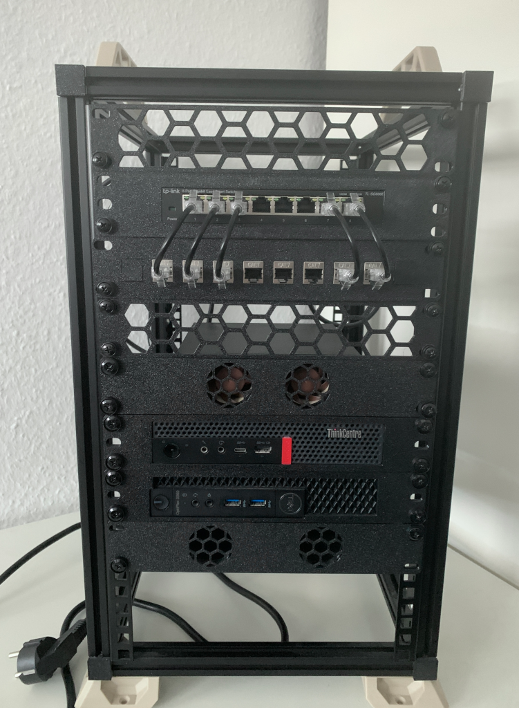
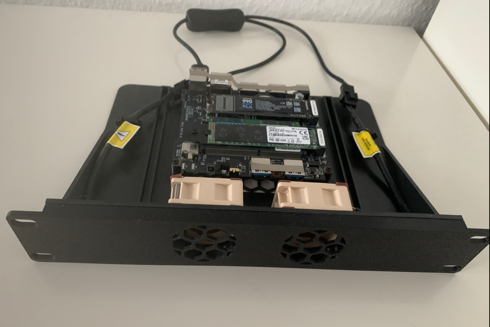

# 🏠 Homelab
# ✨ Intro
Das Repository dokumentiert mein selbst gehostetes Homelab basierend auf Proxmox und Kubernetes. 
Ziel ist es, verschiedene Technologien, Tools und Konzepte durch praktische Erfahrungen besser zu verstehen. 
Dabei versuche ich, so viel wie möglich zu automatisieren und die gesamte Infrastruktur als Code abzubilden.


# 💻 Hardware
Die eingesetzte Hardware befindet sich in einem selbstgebauten 10" Rack. 
- Beelink S12 Mini Pro mit 32 GB RAM, einer 1 TB SSD und einer 256 GB NVMe zum Einsatz (Proxmox). 
- Lenovo M720q mit 48 GB RAM, einer 512 GB SSD und einer 256 GB NVMe zum Einsatz (Proxmox). 

# 🖥️ Proxmox
Die VMs werden mit Terraform erstellt. Dabei werden grundlegende Ressourcen wie CPU, RAM, Netzwerk und Speicher definiert und anschließend in Proxmox bereitgestellt. Die Installation und Konfiguration der Software übernimmt Ansible. Mithilfe von Ansible Playbooks wird die benötigte Software sowie deren Konfiguration konsistent eingerichtet und bereitgestellt.

# 🛳️ Kubernetes
Das laufende Kubernetes Cluster soll, soweit möglich, vollständig mittels GitOps ausgestattet und konfiguriert werden. Geplant ist, interne Services wie Prometheus und Grafana mit FluxCD zu deployen und zu verwalten, während eigene Apps und Services über ArgoCD bereitgestellt und gemanagt werden. Ziel ist es, anhand praktischer Beispiele ein besseres Verständnis für beide Systeme zu entwickeln.

## ⛵ ArgoCD
ArgoCD wird verwendet um Anwendungen automatisch aus der Repository auf dem Kubernetes zu deployen.

# 🚀 Pipeline

Die Pipeline wird dafür genutzt das, sofern möglich, alle deployments automatisiert ausgeführt werden.
Dafür existieren speziell vorbereitete Docker-Images, die jeweils in den einzelnen Schritten genutzt werden.  

Die Pipeline prüft, ob sich in den definierten Pfaden Änderungen ergeben haben. Werden Änderungen erkannt, erscheinen diese in der Übersicht.

## 🐳 Docker

- Änderungen an den Dockerfiles führen automatisch zum Neubau der Images.  
- Die neuen Images werden anschließend in das Registry/Hub gepusht.  

## ⚙️ Ansible

- Änderungen in den Ansible-Dateien (z. B. Host-/Group-Vars) führen zur Ausführung der betroffenen Playbooks.  
- Die Zuordnung erfolgt über die Datei `playbook_mapping.yml` im Ansible-Ordner.  
- **Reihenfolge:** Das DNS-Playbook wird immer zuerst ausgeführt, damit die VM erreichbar ist.  

### Wichtig
- Playbooks werden **nur beim Merge auf den `main`-Branch** ohne `--check` ausgeführt.  
- Logs werden verschlüsselt als Artifact gespeichert.  

## 🌍 Terraform

- Änderungen in den Terraform-Konfigurationen führen zur Erstellung oder Anpassung der betroffenen VMs.  
- Vorab wird eine Übersicht erstellt, in der sichtbar ist, ob Ressourcen hinzugefügt, geändert oder entfernt werden.  
- Der Plan-Output wird – wie bei Ansible – verschlüsselt als Artifact hochgeladen.  

### Wichtig
- `terraform apply` wird **nur beim Merge auf den `main`-Branch** ausgeführt.  

# 🔧 Services

Aktuell wird eine Kombination aus virtuellen Maschinen und Kubernetes-Services betrieben.
Die Umgebunj wird kontinuierlich weiterentwickelt und angepasst.

## Virtuelle Maschinen (VMs)
- 3× **Consul**, Terraform State für die Pipeline
- 2× **DNS**
- 2× **Github Runner**, für die Pipeline
- 3× **Vault**, die derzeit für Kubernetes-Secrets verwendet werden  
- 2× **Loadbalancer**, der Anfragen z.B. an die Vault-Instanzen weiterleitet  
- 3× **K8s** (1 Master und 2 Nodes)  
- 1× **Netbox**, für die Dokumentation
- 1× **Monitoring**, für Prometheus, Grafana
- 1× **Keycloak**, für Grafana und ArgoCD 

## Kubernetes-Services
- **FluxCD**  
- **External Secrets**  
- **Longhorn**  

# 🤖 Ansible
Für die VMs im Homelab wurden und werden eigene Ansible Rollen entwickelt. 
Hierzu zählt z.B. eine `General` Rolle die VMs mit den Basic Settings ausstattet (ssh, firewall, hostname, ... ) oder 
eine `HAProxy` Rolle die es möglich macht mittels url auf verschiedene Backends zu routen.
Jede VM sollte die `General`, `Consul`, `Promtail`, `Node_Exporter` Rolle im Playbook haben damit die Grundeinstellung gesetzt ist.

## Rollen
- General
- Kubernetes
- HAProxy

# 🛡️ Monitoring
Aktuell wird eine VM mit Prometheus, Grafana und Loki verwendet.
Auf den VMs wird per Promtail die Logs gesammelt und an Loki gesendet.
Dazu gibt es verschiedene Exporter die Prometheus mit Daten versorgen.

## Prometheus
In Prometheus werden VMs automatisch über Consul und Service Discovery aufgenommen.

## Exporter
- `Node Exporter` auf allen VMs
- `Bind Exporter` auf DNS VMs
- `Consul Exporter` auf Consul VMs
  
# 🛠️ Configs
## Ansible
Im Ansible-Ordner befindet sich die Pipfile, welche mit dem Befehl ```pipenv shell``` aktiviert werden kann. Fehlende Python Pakete lassen sich anschließend mit ```pipenv install --dev``` installieren. Um die benötigten Ansible Collections und Rollen zu installieren, kann ```ansible-galaxy install -r requirements.yml``` verwendet werden.

## Terraform
### Netbox
```sh
export NETBOX_SERVER_URL=<URL>
export NETBOX_API_TOKEN=<TOKEN>

export TF_VAR_netbox_url=<URL>
export TF_VAR_netbox_token=<TOKEN>
```
### Proxmox
Für die Verbindung zum Proxmox werden folgende Environment Variablen benötigt.
```sh
export PM_API_URL=<URL>
export PM_API_TOKEN_ID=<ID>
export PM_API_TOKEN_SECRET=<SECRET>
```
### VMs
Für die Erstellung von VMs werden folgende Environment Variablen benötigt.
```sh
export TF_VAR_vm_user=<vm_user>
export TF_VAR_vm_ssh_keys=<ssh_keys>
```

### Rack


