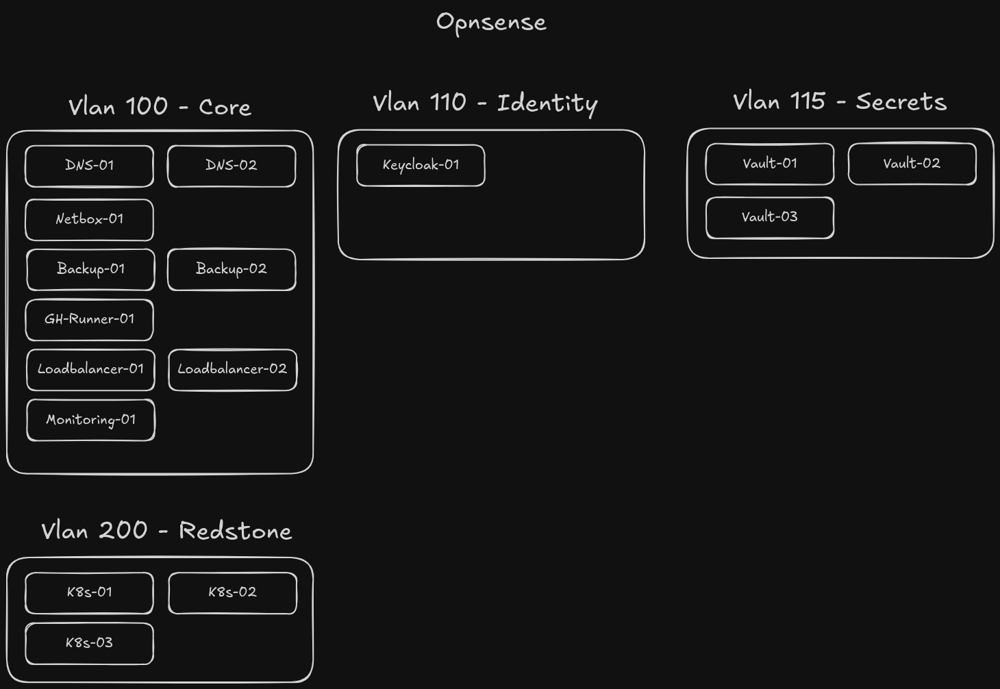
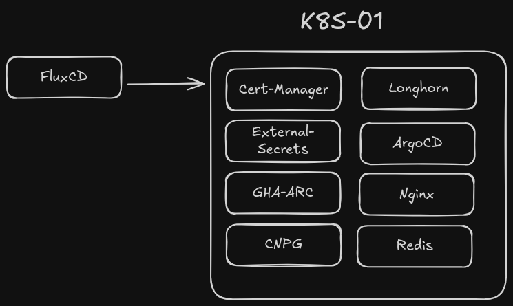

# 🏠 Homelab
# ✨ Intro
Das Repository dokumentiert mein selbst gehostetes Homelab basierend auf Proxmox und Kubernetes. 
Ziel ist es, verschiedene Technologien, Tools und Konzepte durch praktische Erfahrungen besser zu verstehen. 
Dabei versuche ich, so viel wie möglich zu automatisieren und die gesamte Infrastruktur als Code abzubilden.

## Technologie-Stack

| Bereich | Technologie |
|---|---|
| Virtualisierung | Proxmox VE |
| Netzwerk | OPNsense, VLANs, Firewall-Regeln |
| Reverse Proxy | HAProxy |
| Identity Management | Keycloak |
| Secrets Management | HashiCorp Vault |
| Zertifikate | Vault Agent |
| Monitoring | Prometheus, Grafana, Exporter |
| Automation | Terraform, Ansible |
| CI/CD | GitHub Actions |
| Backup | GPG-verschlüsselte Backups |

# 💻 Hardware
Die eingesetzte Hardware befindet sich in einem selbstgebauten 10" Rack. 
- Beelink S12 Mini Pro mit 32 GB RAM, einer 1 TB SSD und einer 256 GB NVMe zum Einsatz (Proxmox). 
- Lenovo M720q mit 48 GB RAM, einer 512 GB SSD und einer 256 GB NVMe zum Einsatz (Proxmox). 

# 🖥️ Proxmox
Die VMs werden mit Terraform erstellt.
Dabei werden grundlegende Ressourcen wie CPU, RAM, Netzwerk und Speicher definiert und anschließend in Proxmox bereitgestellt.
Die Installation und Konfiguration der Software übernimmt Ansible. 
Mithilfe von Ansible Playbooks wird die benötigte Software sowie deren Konfiguration konsistent eingerichtet und bereitgestellt.


## VM Vault und Netbox Backup


# 🔀 OPNsense
OPNsense bildet das zentrale Gateway der Homelab-Infrastruktur und übernimmt das Routing,
die Firewall sowie die Segmentierung des Netzwerks. 
Ziel ist eine klare Trennung der einzelnen Infrastrukturkomponenten,
sodass Dienste nur über explizit definierte Firewall-Regeln miteinander kommunizieren können.

Die Umgebung ist in mehrere VLANs unterteilt,
die jeweils einem bestimmten Verantwortungsbereich zugeordnet sind:

- **Core:** Zentrale Infrastruktur wie DNS, Netbox, Backup, GH-Runner, Loadbalancer und Monitoring
- **Identity:** Authentifizierungsdienste wie Keycloak
- **Secrets:** Beinhaltet Vault als zentrale Instanz für Secret-Management, Zertifikatsverwaltung und zukünftige PKI-Funktionalitäten.
- **Redstone:** User Services z.B. auf Kubernetes

Das Routing zwischen den einzelnen VLANs erfolgt ausschließlich über OPNsense.
Standardmäßig ist der Verkehr zwischen den Sicherheitszonen untersagt und wird nur dort freigegeben, wo eine Kommunikation technisch erforderlich ist.



# 🛳️ Kubernetes
Das laufende Kubernetes Cluster ist, vollständig mit GitOps ausgestattet und konfiguriert.
Interne Services wie Prometheus und Grafana werden mit FluxCD  deployed und verwaltet,
während eigene Apps und Services über ArgoCD bereitgestellt und gemanagt werden.
Ziel ist es, anhand praktischer Beispiele ein besseres Verständnis für beide Systeme zu entwickeln.



# 🚀 Automation & CI/CD

Die Infrastruktur wird über eine automatisierte CI/CD Pipeline verwaltet.
Änderungen werden erkannt, validiert und abhängig vom betroffenen Bereich durch Terraform, Ansible oder Docker-Workflows verarbeitet.

| Technologie | Aufgabe | Auslöser |
|---|---|---|
| GitHub Actions | Orchestrierung der CI/CD Pipeline | Änderungen im Repository |
| Docker | Erstellung und Veröffentlichung eigener Images | Änderungen an Dockerfiles |
| Terraform | Provisionierung und Anpassung virtueller Infrastruktur | Änderungen an Terraform-Konfigurationen |
| Ansible | Konfiguration und Administration der Systeme | Änderungen an Playbooks oder Variablen |

## Pipeline Prinzipien

| Bereich | Umsetzung |
|---|---|
| Deployment | Änderungen werden automatisch erkannt und den passenden Workflows zugeordnet |
| Terraform | Änderungen werden zuerst per Plan überprüft |
| Ansible | Änderungen werden vor der Ausführung validiert |
| Produktionseingriffe | Ausführung von Änderungen nur nach Merge in den `main` Branch |
| Artefakte | Logs und Plan-Ausgaben werden verschlüsselt gespeichert |

## Deployment-Struktur

Die Infrastruktur ist in verschiedene Bereiche aufgeteilt, welche unabhängig voneinander verarbeitet werden können.

| Bereich | Beispiele |
|---|---|
| Core | DNS, Netbox, Backup, ... |
| Identity | Keycloak |
| Secrets | Vault |
| Redstone | Kubernetes |

# 🔧 Services

Aktuell wird eine Kombination aus virtuellen Maschinen und Kubernetes-Services betrieben.
Die Umgebunj wird kontinuierlich weiterentwickelt und angepasst.

## Virtuelle Maschinen (VMs)
| Anzahl | Komponente | Zweck |
|---|---|---|
| 2× | DNS Server | Bereitstellung der internen Namensauflösung |
| 2× | Load Balancer | Zentrale Eingangspunkte für interne Services und Weiterleitung an Backend-Systeme |
| 3× | Vault Server | Zentrales Secret Management und Verwaltung von TLS-Zertifikaten |
| 3× | Kubernetes Nodes | Container-Plattform für Workloads (1 Control Plane, 2 Worker Nodes) |
| 1× | Monitoring Server | Prometheus und Grafana für Metriken und Visualisierung |
| 1× | Keycloak | Zentrale Authentifizierung über OIDC (aktuell für Grafana) |
| 1× | NetBox | Dokumentation der Infrastruktur und Netzwerkressourcen |
| 2× | Backup Server | Backup-Ziel für S3-Daten und Terraform State |
| 2× | GitHub Runner | Ausführung der CI/CD Pipelines |

### Historische VMs

| Komponente | Status |
|---|---|
| Consul Cluster (3 Nodes) | Nicht mehr aktiv, ursprünglich als Terraform State Backend verwendet |

## Kubernetes-Services
### Redstone k8s-01
| Bereich                | Technologie               |
| ---------------------- | ------------------------- |
| GitOps                 | Flux                      |
| Application Deployment | ArgoCD                    |
| Ingress                | NGINX Ingress Controller  |
| TLS Management         | Cert-Manager              |
| Secrets                | External Secrets Operator |
| Storage                | Longhorn                  |
| Datenbanken            | PostgreSQL, Redis         |
| CI/CD                  | Github Runner             |

# 🤖 Ansible
Für die VMs im Homelab wurden und werden eigene Ansible Rollen entwickelt. 
Hierzu zählt z.B. eine `General` Rolle die VMs mit den Basic Settings ausstattet (ssh, firewall, hostname, ... ) oder 
eine `HAProxy` Rolle die es möglich macht mittels url auf verschiedene Backends zu routen.
Jede VM sollte die `General`, `Node_Exporter` Rolle im Playbook haben damit die Grundeinstellung gesetzt ist.

## Eigene Rollen
- General
- Kubernetes
- HAProxy
- Minio

# 🛡️ Monitoring
Aktuell wird eine VM mit Prometheus, Grafana und Loki verwendet.
Auf den VMs wird per Promtail die Logs gesammelt und an Loki gesendet.
Dazu gibt es verschiedene Exporter die Prometheus mit Daten versorgen.

## Prometheus
In Prometheus werden VMs automatisch über Consul und Service Discovery aufgenommen.

## Exporter
- `Node Exporter` auf allen VMs
- `Bind Exporter` auf DNS VMs
  
# 🛠️ Configs
## Ansible
Im Ansible-Ordner befindet sich die Pipfile, welche mit dem Befehl ```pipenv shell``` aktiviert werden kann. Fehlende Python Pakete lassen sich anschließend mit ```pipenv install --dev``` installieren. Um die benötigten Ansible Collections und Rollen zu installieren, kann ```ansible-galaxy install -r requirements.yml``` verwendet werden.

## Terraform
### Netbox
```sh
export NETBOX_SERVER_URL=<URL>
export NETBOX_API_TOKEN=<TOKEN>

export TF_VAR_netbox_url=<URL>
export TF_VAR_netbox_token=<TOKEN>

```

### Minio
```sh
# Bootstrap
export TF_VAR_minio_server=<MINIO_SERVER>
export TF_VAR_minio_user=<MINIO_USER>
export TF_VAR_minio_password=<MINIO_PASSWORD>

# S3 backend
export AWS_ACCESS_KEY_ID=<MINIO_USER>
export AWS_SECRET_ACCESS_KEY=<MINIO_PASSWORD>
```
### Vault
```sh
export TF_VAR_vault_address=<VAULT_ADDR>
export TF_VAR_vault_token=<VAULT_TOKEN>
```

### DNS
```sh
export TF_VAR_dns_update_server=<DNS_SERVER>
export TF_VAR_dns_update_key_name=<DNS_UPDATE_KEY_NAME>
export TF_VAR_dns_update_key_algorithm=<DNS_UPDATE_KEY_ALGO>
export TF_VAR_dns_update_key_secret=<DNS_UPDATE_KEY_SECRET>
```
### Proxmox
Für die Verbindung zum Proxmox werden folgende Environment Variablen benötigt.
```sh
export PM_API_URL=<URL>
export PM_API_TOKEN_ID=<ID>
export PM_API_TOKEN_SECRET=<SECRET>
```
### VMs
Für die Erstellung von VMs werden folgende Environment Variablen benötigt.
```sh
export TF_VAR_vm_user=<vm_user>
export TF_VAR_vm_ssh_keys=<ssh_keys>
```

### Rack


